# Guia de Eletrônica UFSC -Botcem


Autor: André Luís Corrêa Barbado

## Resumo:


Conceitos Fundamentais:

1. Corrente: fluxo de elétrons através de um condutor; medida em amperes (A).
2. Tensão: força que impulsiona elétrons através de um condutor; medida em volts (V).
3. Potência: taxa na qual a energia elétrica é transferida ou consumida em um circuito; medida em watts
    (W).

Componentes Eletrônicos Passivos:

4. Resistor: componente que oferece resistência à passagem de corrente elétrica.
5. Capacitor: dispositivo que armazena energia elétrica na forma de um campo elétrico.
6. Indutor: componente que armazena energia na forma de um campo magnético.

Componentes Eletrônicos Ativos:

7. Diodo: componente que permite a passagem de corrente elétrica em apenas uma direção.
8. Transistor: dispositivo semicondutor usado para amplificar ou comutar sinais eletrônicos e potência.
9. MOSFET: tipo de transistor comumente usados em circuitos de alta frequência e baixa potência.

Circuitos e Configurações:

10. Série paralelo: métodos de conexão de componentes eletrônicos em um circuito.
11. Divisor de tensão: circuito simples que divide a tensão de entrada em valores menores.
12. Ponte H: circuito eletrônico usados para controlar a direção e velocidade de motores de corrente
    contínua.

Conversores e Controle de Potência:

13. Buck: conversor CC-CC que diminui a tensão de entrada, aumentando a corrente.
14. Boost: conversor CC-CC que aumenta a tensão de entrada, diminuindo a corrente.
15. PWM (Modulação por Largura de Pulso): técnica de controle de potência por meio da variação da
    largura dos pulsos de uma forma de onda.

Tipos de Sinais e Sistemas:

16. DC (Corrente Contínua): corrente elétrica que flui em uma direção constante.
17. AC (Corrente Alternada): corrente elétrica que muda de direção periodicamente.
18. Digital: sistema que representa informações por meio de valores discretos (0 e 1).
19. Analógico: sistema que representa informações por meio de uma faixa contínua de valores.


Ferramentas de Medição e Teste:

20. Multímetro: instrumento de medição que verifica tensão, corrente e resistência.
21. Osciloscópio: instrumento de medição que exibe formas de onda de tensão e corrente ao longo do
    tempo.

Dispositivos e Plataformas:

22. Relé: componente eletromecânico que controla um circuito de alta potência a partir de um sinal de baixa
    potência.
23. CI (Circuito Integrado): conjunto de componentes eletrônicos miniaturizados em um único chip.
24. Microcontrolador: CI programável projetado para controlar dispositivos eletrônicos.
25. PCB (Placa de Circuito Impresso): suporte físico que conecta e suporta componentes eletrônicos.
26. Protoboard: plataforma de teste

## Conceitos Fundamentais:


Vamos explorar os conceitos de tensão, corrente e potência em eletricidade usando analogias para
facilitar a compreensão:

**1. Tensão (V):**

A tensão, medida em volts (V), é a diferença de potencial
elétrico entre dois pontos em um circuito. Você pode pensar
na tensão como a "força" ou "pressão" que impulsiona os
elétrons a se moverem através de um circuito elétrico.

Analogia: Imagine a água fluindo através de um cano. A tensão
seria comparável à pressão da água que empurra o líquido
através do cano. Quanto maior a pressão, maior a força com
que a água se move.

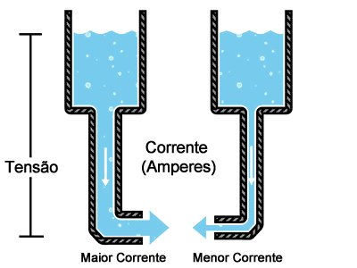


**2. Corrente (I):**

A corrente elétrica, medida em amperes (A), é o fluxo de
elétrons através de um condutor. A corrente é a quantidade
de carga elétrica que passa por um ponto específico em um
circuito durante um determinado período de tempo.
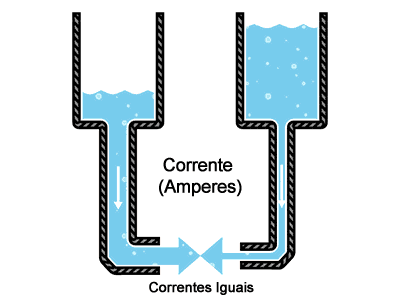

Analogia: voltando ao exemplo do cano de água, a corrente
seria comparável à quantidade de água que flui através do cano. Um cano com maior fluxo de água
terá uma corrente maior, enquanto um cano com menor fluxo terá uma corrente menor.

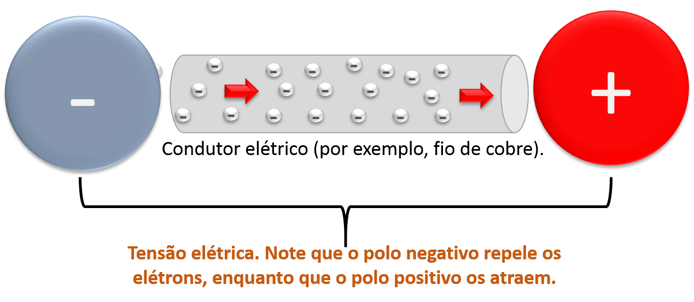

**3. Potência (P):**

A potência elétrica, medida em watts (W), é a taxa na qual a energia elétrica é transferida ou
consumida em um circuito. A potência pode ser calculada multiplicando-se a tensão pela corrente

```
(P = V * I)
```
Analogia: pense em um moinho de água, onde a água flui através de uma roda dentada para gerar
energia mecânica. A potência nesse caso seria comparável à quantidade de energia produzida pela
roda dentada. Se a pressão da água (tensão) e a quantidade de água (corrente) forem maiores, a roda
dentada produzirá mais energia (potência).

Em resumo, a tensão impulsiona a corrente através de um circuito elétrico, e a potência é a energia
resultante desse processo. Ao trabalhar com circuitos elétricos, é importante compreender esses três
conceitos fundamentais e suas interações, pois eles desempenham um papel crucial no
funcionamento de dispositivos eletrônicos e na resolução de problemas elétricos.

Vídeo explicativo do manual do mundo: Qual a diferença entre volt, watt e ampere?

<iframe width="560" height="315" src="https://www.youtube.com/embed/JtttnL28m3Q" frameborder="0" allow="accelerometer; autoplay; clipboard-write; encrypted-media; gyroscope; picture-in-picture" allowfullscreen></iframe>

## Componentes Eletrônicos:

**1. Resistor:**

Um resistor é um componente eletrônico que oferece resistência à
passagem de corrente elétrica. Ele é usado para limitar a corrente e
controlar a tensão em um circuito.

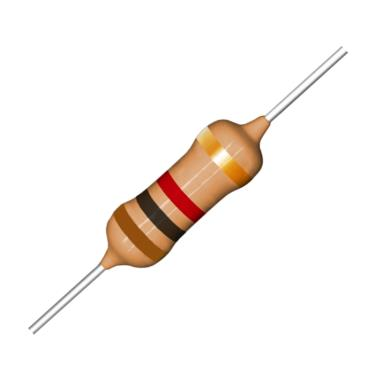

Analogia: Um resistor pode ser comparado a uma estrada estreita que
dificulta a passagem de veículos (elétrons). Quanto mais estreita a
estrada, maior a resistência ao fluxo de tráfego.

Simbolo em circuitos eletricos:

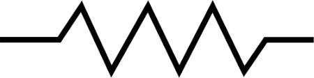

**2. Capacitor:**

O que é Capacitor? Para o que serve?

<iframe width="560" height="315" src="https://www.youtube.com/embed/ypmOV0tKqos" frameborder="0" allow="accelerometer; autoplay; clipboard-write; encrypted-media; gyroscope; picture-in-picture" allowfullscreen></iframe>


Um capacitor é um dispositivo que armazena energia elétrica na forma de um campo elétrico. Ele
pode carregar e descarregar rapidamente, fornecendo energia quando necessário.

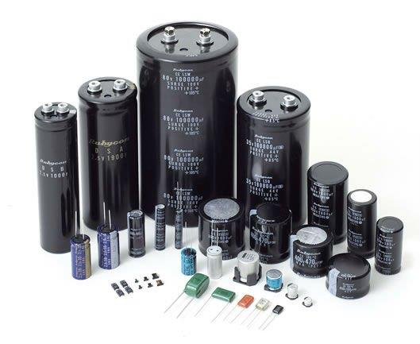
Analogia: Um capacitor pode ser comparado a um
pequeno tanque de água com uma membrana flexível no
meio. Quando a água (carga elétrica) é bombeada para
um lado do tanque, a membrana se estica, armazenando
energia potencial. Quando a água é liberada, a energia
potencial é convertida em energia cinética.

**3. Indutor:**

Um indutor é um componente que armazena energia na
forma de um campo magnético, criado pelo fluxo de
corrente através de uma bobina de fio. Ele se opõe a
mudanças na corrente que o atravessa.

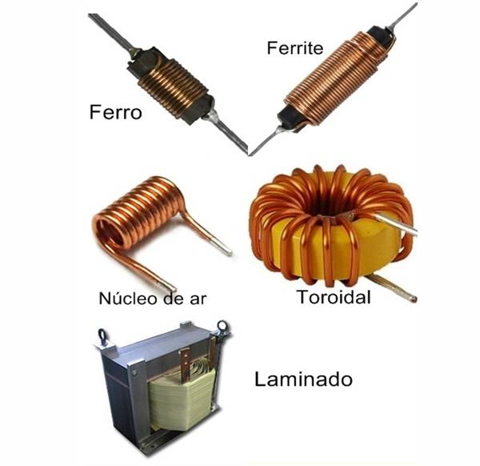

Analogia: Um indutor pode ser comparado a um volante em
movimento. Quando você tenta alterar sua velocidade, o
volante opõe resistência devido à sua energia cinética
armazenada (campo magnético).

**4. Diodo:**

Um diodo é um componente eletrônico que permite a passagem de corrente elétrica em apenas uma
direção, atuando como uma "válvula" para o fluxo de elétrons.

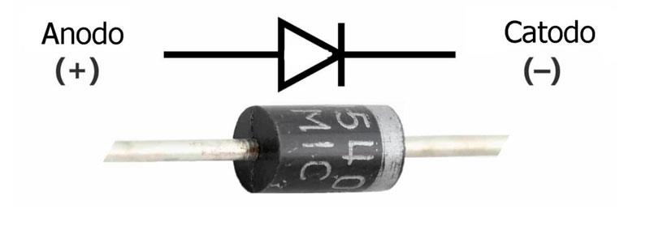
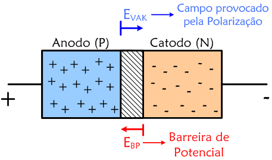

Analogia: Um diodo pode ser comparado a uma porta de sentido único, permitindo que as pessoas
(elétrons) passem apenas em uma direção e bloqueando o movimento na direção oposta.


5. Transistor:

Um transistor é um dispositivo semicondutor que
pode ser usado para amplificar ou comutar sinais
eletrônicos e potência. Ele possui três terminais:
emissor, base e coletor.

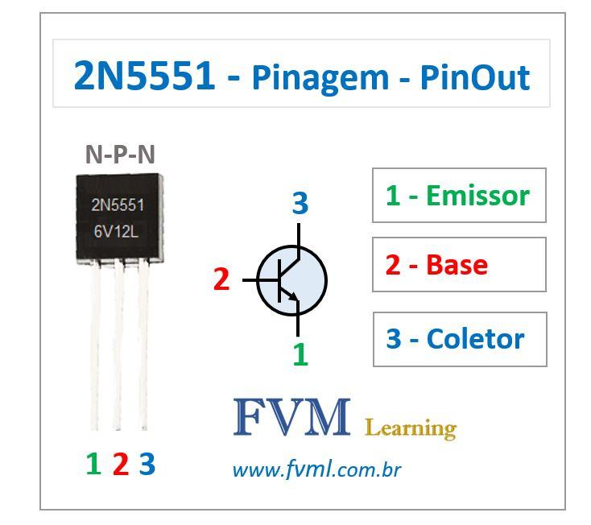

Analogia: Um transistor pode ser comparado a uma
torneira controlada por uma válvula. A válvula (base)
controla a quantidade de água (corrente) que flui
entre a entrada (emissor) e a saída (coletor).

##### 6. MOSFET:

Um MOSFET (transistor de efeito de campo
de óxido metálico-semicondutor) é um tipo
específico de transistor usado
principalmente em circuitos de alta
frequência e baixa potência. Ele é
controlado por uma tensão aplicada ao seu
terminal de porta (gate).

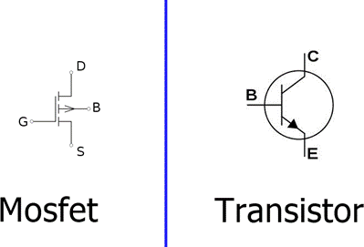

Analogia: Um MOSFET pode ser comparado a uma válvula solenoide que controla o fluxo de água
(corrente) entre uma entrada e uma saída com base em um sinal elétrico aplicado (tensão no gate).


7. Ponte H

Uma ponte H é um circuito eletrônico usado para controlar a direção e a velocidade de motores de
corrente contínua. Ele consiste em quatro interruptores (geralmente transistores ou MOSFETs)
dispostos de tal forma que podem inverter a polaridade da tensão aplicada ao motor.

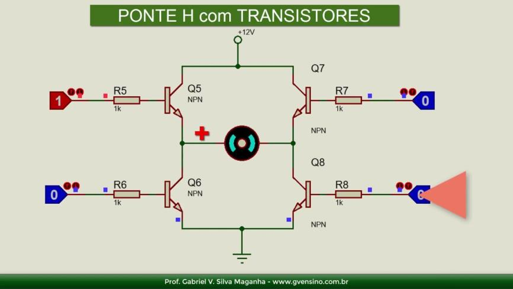
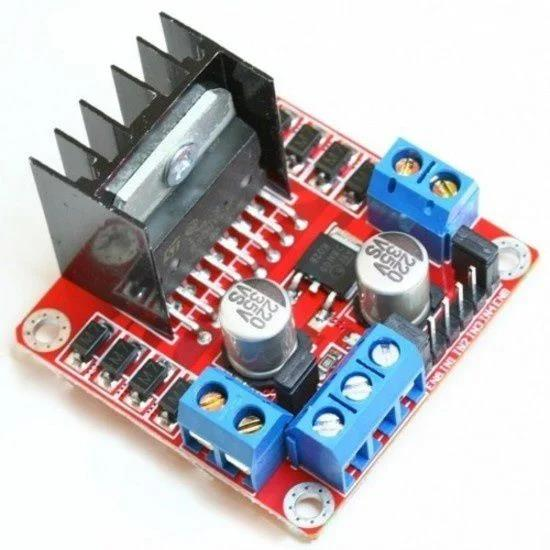

Analogia: Uma ponte H pode ser comparada a um sistema de controle de trilhos de trem que permite
que um trem (motor) vá para frente ou para trás, dependendo da configuração dos interruptores
(transistores ou MOSFETs).

8. Relé:

Um relé é um dispositivo eletromecânico que permite que um
circuito de baixa potência controle outro circuito de alta potência.
Ele possui um eletroímã que, quando energizado, fecha ou abre
contatos elétricos.

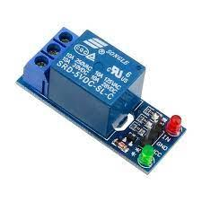
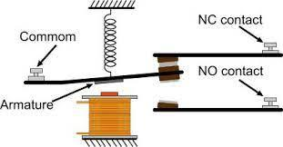

Analogia: Um relé pode ser comparado a um
interruptor controlado remotamente. Quando você
aperta um botão em um controle remoto (baixa
potência), uma luz (alta potência) é ligada ou
desligada por meio do relé.


## Tipos de Sinais e Sistemas:

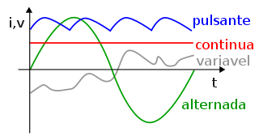

1. Corrente Contínua (DC):

A corrente contínua (DC) é um tipo de corrente elétrica que flui em uma única direção. A tensão em
uma fonte de corrente contínua é constante, e a polaridade (positivo e negativo) também permanece
inalterada. As baterias e as fontes de alimentação de dispositivos eletrônicos, como computadores e
smartphones, são exemplos de fontes de corrente contínua.

2. Corrente Alternada (AC):

A corrente alternada (AC) é um tipo de corrente elétrica em que a direção do fluxo e a polaridade
mudam periodicamente. A tensão em uma fonte de corrente alternada varia sinusoidalmente com o
tempo. A corrente alternada é comumente usada na distribuição de energia elétrica, pois pode ser
facilmente transformada em diferentes tensões e correntes por meio de transformadores. A
eletricidade que chega às residências e empresas é geralmente fornecida em corrente alternada.

Diferença entre DC e AC:

A principal diferença entre a corrente contínua
e a corrente alternada está na direção do fluxo
de corrente e na variação da tensão e
polaridade. Enquanto a corrente contínua flui
em uma direção constante com tensão e
polaridade fixas, a corrente alternada muda sua
direção e polaridade periodicamente com
tensão variável.


3. Digital:
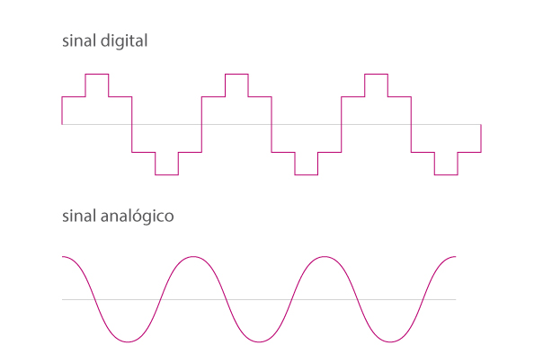


Um sinal digital é um tipo de sinal que possui valores discretos e finitos. Ele representa informações
por meio de uma sequência de bits (0s e 1s). Os sistemas digitais usam a lógica binária para
processar e transmitir
informações. A eletrônica digital,
como computadores,
microcontroladores e dispositivos
de comunicação, lida com sinais
digitais.

4. Analógico:


Um sinal analógico é um tipo de
sinal que possui uma gama
contínua e infinita de valores. Ele
representa informações por meio
de variações contínuas de tensão ou corrente. Os sistemas analógicos processam e transmitem
informações com base em grandezas físicas contínuas, como som e luz. A eletrônica analógica,
como amplificadores de áudio e rádios, lida com sinais analógicos.

Diferença entre digital e analógico:
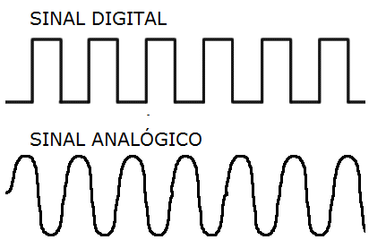

A principal diferença entre os sinais
digitais e analógicos está na forma
como as informações são
representadas e processadas.
Enquanto os sinais digitais usam
valores discretos (0s e 1s) para
representar informações, os sinais
analógicos usam variações contínuas
de tensão ou corrente. A eletrônica
digital e analógica lida com esses
tipos de sinais de maneiras diferentes,
com aplicações específicas em várias áreas da tecnologia.


## Circuitos e Configurações:

1. Conexões em série: Neste tipo de conexão, os componentes são conectados um após o outro, formando um único caminho para a corrente elétrica. A corrente é a mesma em todos os componentes, e a tensão total é a soma das tensões em cada componente.

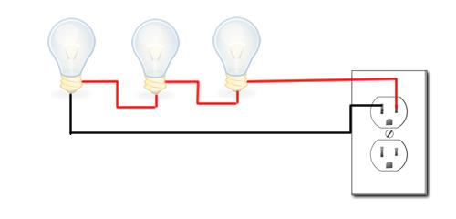

Analogia: Pense em uma sequência de luzes de Natal conectadas em série. Se uma lâmpada queimar,
todo o circuito será interrompido e as luzes restantes apagarão.

2. Conexões em paralelo: Neste tipo de conexão, os componentes são conectados em paralelo, cada um formando um caminho separado para a corrente elétrica. A tensão é a mesma em
todos os componentes, e a corrente total é a soma das correntes em cada componente.

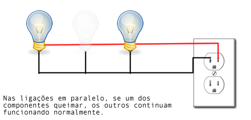


Analogia: Pense em várias lâmpadas conectadas em paralelo, cada uma com seu próprio interruptor.
Se uma lâmpada queimar, as outras continuarão acesas, pois cada uma tem seu próprio caminho
para a corrente elétrica.

[http://www.eletrocode.com.br/ligacoes-em-serie-e-em-paralelo/](http://www.eletrocode.com.br/ligacoes-em-serie-e-em-paralelo/)

Divisor de tensão:

Um divisor de tensão é um circuito que
divide a tensão de entrada em várias
tensões de saída menores. Isso é
geralmente realizado usando resistores
em série. A tensão em cada resistor é
proporcional à sua resistência, de
acordo com a Lei de Ohm (V = I * R),
onde V é a tensão, I é a corrente e R é a resistência.

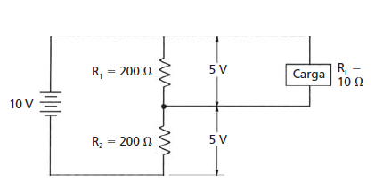

Analogia: Imagine um cano de água com várias torneiras ao longo dele. A pressão da água (tensão)
pode ser dividida entre as torneiras abertas, de modo que a pressão em cada torneira seja menor do
que a pressão total no cano. A quantidade de água que sai de cada torneira (tensão) depende do quão
aberta ela está (resistência).

## Conversores e Controle de Potência:

1. Conversor Buck:

Um conversor buck, também conhecido como regulador redutor, é um
tipo de conversor DC-DC que reduz a tensão de entrada para uma tensão
de saída menor. Ele usa um indutor, um capacitor, um diodo e um

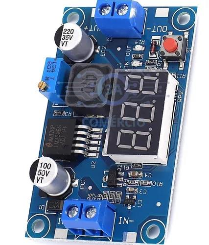

interruptor (normalmente um transistor ou MOSFET) para regular a tensão de saída.

Analogia: Pense em um conversor buck como uma bicicleta com várias marchas. Ao mudar de uma
marcha alta (alta tensão) para uma marcha baixa (baixa tensão), você reduz a velocidade (tensão de
saída) enquanto aumenta a força (corrente de saída).

2. Conversor Boost:

Um conversor boost, também conhecido como regulador elevador,
é um tipo de conversor DC-DC que aumenta a tensão de entrada
para uma tensão de saída maior. Ele também usa um indutor, um
capacitor, um diodo e um interruptor, mas com uma configuração
diferente do conversor buck.

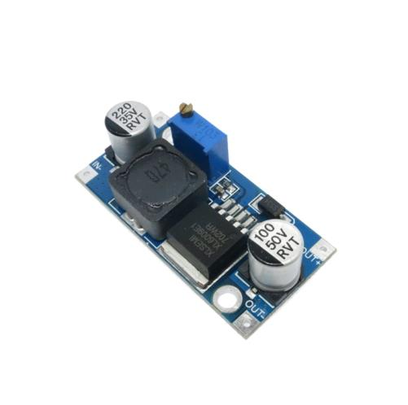

Analogia: Usando a analogia da bicicleta, um conversor boost seria como mudar de uma marcha baixa
(baixa tensão) para uma marcha alta (alta tensão). Isso aumenta a velocidade (tensão de saída)
enquanto reduz a força (corrente de saída).

3. PWM (modulação por largura de pulso):

A modulação por largura de pulso (PWM) é uma técnica
usada para controlar a quantidade de energia entregue a
uma carga, variando o ciclo de trabalho de um sinal
elétrico. O ciclo de trabalho é a fração de tempo em que o
sinal está "ligado" em relação ao tempo total do ciclo. Ao
ajustar o ciclo de trabalho, é possível controlar a energia
média entregue à carga.

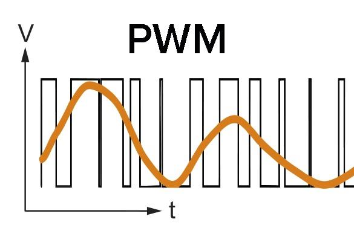


Analogia: Imagine acender e apagar rapidamente uma lâmpada. Se a lâmpada for ligada por um longo
período e desligada por um curto período (alto ciclo de trabalho), a sala ficará mais iluminada. Se a
lâmpada for ligada por um curto período e desligada por um longo período (baixo ciclo de trabalho), a
sala ficará mais escura. Ajustando a proporção entre os períodos "ligado" e "desligado", é possível
controlar a quantidade de luz (energia) entregue à lâmpada.

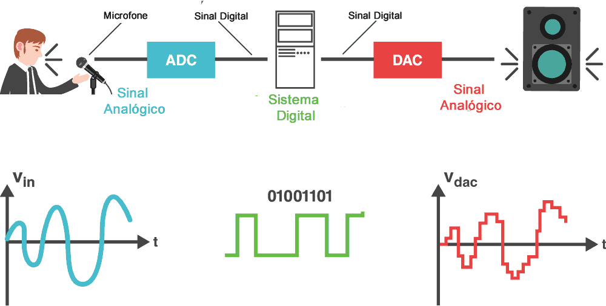

### Guia básico para usar um multímetro:

<iframe width="560" height="315" src="https://www.youtube.com/embed/1WIWrmc-rBk" frameborder="0" allow="accelerometer; autoplay; clipboard-write; encrypted-media; gyroscope; picture-in-picture" allowfullscreen></iframe>

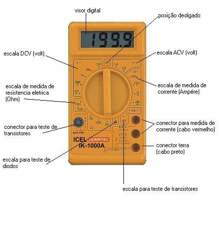

1. Um multímetro é um dispositivo de
medição que pode medir várias grandezas
elétricas, como tensão, corrente e resistência.
Ele possui um mostrador, botões e/ou um
seletor rotativo, além de entradas para as pontas de prova.


2. Conecte a ponta de prova preta na entrada COM (comum) e a ponta de prova vermelha na entrada apropriada para a medição desejada (tensão, corrente ou resistência).


Configure o multímetro:

3. Selecione a função desejada (tensão, corrente ou resistência) e a escala adequada usando o
    seletor rotativo ou os botões.

#### Medindo tensão (DC ou AC):

1. Selecione a função de tensão (V) e escolha DC ou AC, conforme necessário.

2. Conecte as pontas de prova nos pontos de teste do circuito (vermelho para o lado positivo e preto
para o lado negativo).

3. Leia a tensão no visor do multímetro.

#### Medindo corrente (DC ou AC):

1. Selecione a função de corrente (A) e escolha DC ou AC, conforme necessário.

2. Desconecte o circuito e insira o multímetro em série com o componente cuja corrente você deseja
medir (vermelho para o lado positivo e preto para o lado negativo).

3. Leia a corrente no visor do multímetro.

#### Medindo resistência:

1. Selecione a função de resistência (Ω).

2. Desligue a energia do circuito e desconecte o componente cuja resistência você deseja medir.

3. Conecte as pontas de prova aos terminais do componente (a polaridade não importa neste caso).

4. d. Leia a resistência no visor do multímetro.

ATENÇÃO LIGAR AS PONTEIRAS ERRADAS, OU SELECIONAR O MODO ERRADO PODE QUEIMAR O MULTÍMETRO OU O COMPONENTE,
EM CASO DE POTÊNCIAS ALTAS ( GRANDES GERADORES INDUSTRIAIS) O ERRO PODE CAUSAR CURTO CIRCUITO E PODE LEVAR O
OPERADOR A MORTE. Dito isso, aqui utilizaremos baixa tensão e multímetros de até 40 reais, é improvável que queime o aparelho e em
caso de erro não apresentaria riscos ao operador mas é sempre bom lembrar dos possíveis riscos.


## Diferenças entre multímetro e osciloscópio.


Embora ambos os dispositivos sejam usados para medir grandezas elétricas, eles têm usos e capacidades
diferentes. Um multímetro é uma ferramenta versátil para medir tensão, corrente e resistência de forma
estática. Por outro lado, um osciloscópio é usado para visualizar a forma de onda de um sinal elétrico,
permitindo aos usuários examinar suas características de tempo e amplitude. Isso faz do osciloscópio uma
ferramenta valiosa para diagnosticar problemas que podem não ser aparentes com um multímetro, como
flutuações rápidas na tensão ou na corrente.

### Guia básico para usar um osciloscópio:
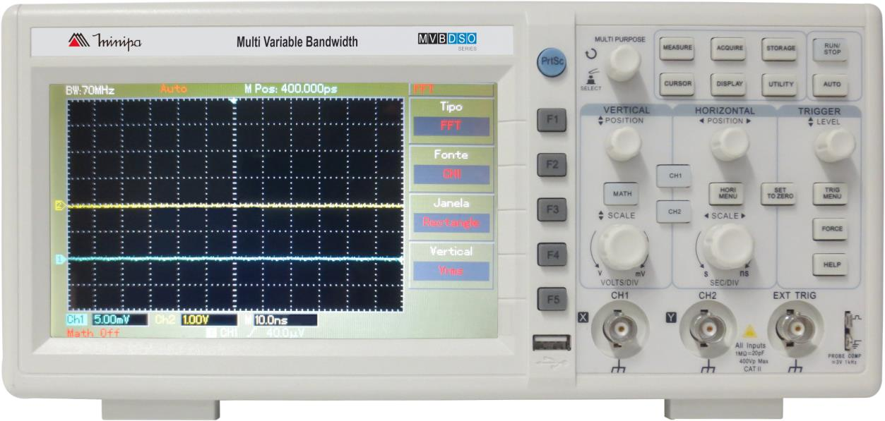
Familiarize-se com o osciloscópio:

1. Um osciloscópio é um dispositivo de medição usado para visualizar sinais elétricos como uma
    função do tempo. Ele possui um visor, botões, um seletor rotativo e entradas para sondas.

Conecte a sonda:

2. Conecte a sonda à entrada do canal no osciloscópio. A maioria dos osciloscópios possui pelo
    menos dois canais para medir e comparar sinais simultaneamente.


Calibre a sonda:

3. A maioria dos osciloscópios possui um terminal de calibração para ajustar a sonda. Conecte a
    sonda ao terminal de calibração e ajuste o compensador de sonda (um pequeno parafuso ou
    botão na sonda) até que o sinal exibido seja o esperado (normalmente um quadrado).

Configure o osciloscópio:

a. Ajuste a posição vertical e horizontal do traço (linha do gráfico) usando os controles do
osciloscópio.

b. Selecione o modo de aquisição (normalmente automático ou normal).

c. Ajuste a escala de tempo horizontal (segundos/divisão) e a escala de tensão vertical
    (volts/divisão) usando os controles rotativos.

Conecte a sonda ao circuito:

a. Conecte a ponta de terra da sonda (geralmente uma garra jacaré) a um ponto de terra no circuito.

b. Conecte a ponta da sonda ao ponto de teste do circuito.

Ajuste o gatilho (trigger):

c. Ajuste o nível e o tipo de gatilho (subida ou descida) para estabilizar e sincronizar a exibição do
    sinal no osciloscópio.

Analise o sinal:

a. Observe o sinal no visor do osciloscópio.

b. Use os controles de escala de tempo e tensão para ajustar a exibição do sinal conforme
necessário.

c. Utilize as funções de medição do osciloscópio para obter informações adicionais, como frequência, amplitude, período e outras características do sinal.


Capture e armazene dados (opcional):

a. Se o osciloscópio tiver recursos de armazenamento de dados, você pode capturar e armazenar
    o sinal para análise posterior.

Lembre-se de que este é um guia básico e pode haver variações entre diferentes modelos de
osciloscópios. Consulte o manual do usuário do seu osciloscópio específico para obter informações
detalhadas sobre como operá-lo.

### Dispositivos e Plataformas:

1. PCB (Placa de Circuito
Impresso):

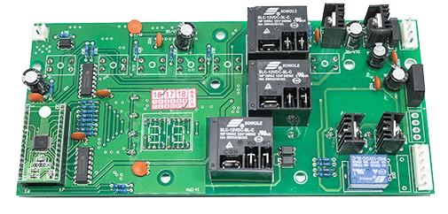

Uma PCB (Printed Circuit Board) é uma
placa que suporta e interconecta
componentes eletrônicos. Ela é
composta de várias camadas de
material isolante, como fibra de vidro,
com camadas de trilhas condutoras,
geralmente feitas de cobre. As trilhas condutoras interligam os componentes eletrônicos soldados na placa,
formando o circuito.

Exemplo: Uma placa-mãe de computador é um exemplo de uma PCB complexa que contém vários componentes
eletrônicos, como processadores, memória e conectores, todos interconectados por trilhas condutoras.


2. CI (Circuito Integrado):

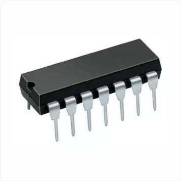

Um CI (Circuito Integrado) é um conjunto compacto de componentes eletrônicos e
suas interconexões, fabricado em um único substrato de material semicondutor,
como silício. Os CI's são usados para executar uma ampla variedade de funções,
desde amplificação de sinais e geração de ondas até processamento de informações
e controle de dispositivos.

Exemplo: O microprocessador em um computador é um exemplo de um CI complexo
que executa bilhões de operações por segundo para
processar informações e executar tarefas.

**3. Protoboard:**

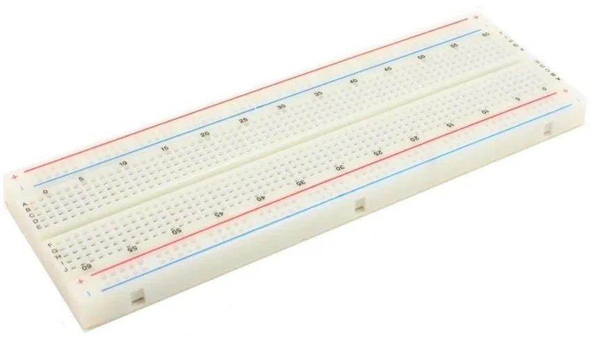

Uma protoboard é uma ferramenta usada para montar
e testar circuitos eletrônicos de forma rápida e fácil,
sem a necessidade de solda. Ela contém várias
fileiras e colunas de orifícios interconectados
eletricamente por trilhas condutoras internas.
Componentes eletrônicos e fios podem ser inseridos nos orifícios para criar um circuito, que pode ser facilmente
modificado ou ajustado conforme necessário.

Exemplo: Um estudante de engenharia elétrica pode usar uma protoboard para testar e ajustar um projeto de
circuito, como um amplificador de áudio ou um controlador de motor, antes de criar uma PCB final para o projeto.

**4. Microcontrolador:**

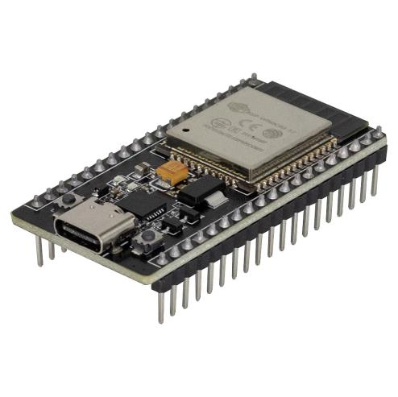


Um microcontrolador é um CI compacto que contém um processador,
memória e periféricos de entrada/saída (I/O), projetado para controlar
dispositivos e sistemas eletrônicos. Ele pode ser programado para executar
uma variedade de tarefas, como ler sensores, controlar motores e se

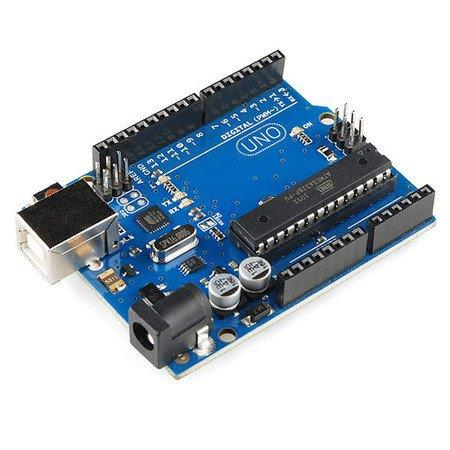

comunicar com outros dispositivos. Os microcontroladores são comumente usados em sistemas embarcados e
aplicações de automação.

Exemplo: Um termostato inteligente pode usar um microcontrolador para ler a temperatura ambiente, controlar o
sistema de aquecimento e ar-condicionado e se comunicar com outros dispositivos inteligentes na casa.

https://www.citisystems.com.br/lei-de-ohm/


