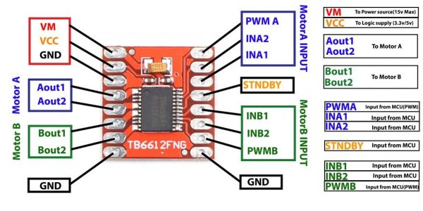

# Estudo sobre Ponte H
## Índice
1. [Introdução](#Introdução)
2. [Funcionamento](#Funcionamento)
3. [Modelos](#Modelos)
4. [Comparação](#Comparação)
5. [Prós e contras](#Prós-e-contras)
6. [Aplicações](#Aplicações)
7. [Cuidados](#Cuidados)
8. [SMD](#SMD)

## Introdução 
As pontes H são circuitos eletrônicos amplamente utilizados para controle de motores de corrente contínua (DC). Elas permitem que o motor gire em ambas as direções, horária e anti-horária, o que é fundamental em aplicações de robótica e automação.

## Funcionamento
O funcionamento da ponte H é baseado na alternância do fluxo de corrente que atravessa o motor. Isso é feito através do acionamento de quatro chaves (geralmente transistores ou relés) que controlam a direção da corrente. A configuração das chaves forma um "H", daí o nome "ponte H".

## Modelos
Existem vários modelos de pontes H disponíveis no mercado, cada um com suas próprias especificações e adequados para diferentes aplicações. Neste documento, focaremos em quatro modelos que já utilizamos na equipe: L298N, DRV8833, TB6612 e TB9051FTG.

### L298N
O modelo mais comumente vendido de ponte H para uso em Arduino é o L298N porém não costumamos utilizá-la nos projetos a mais de 6 anos.  Está pornte h é excessivamente grande e possui muita perda de potência em forma de calor, além de não possuir vantagens econômicas em relação às outras.

### DRV8833
É uma ótima opção pequena e barata, conseguimos comprar da china por 3 reais e no Brasil por 25, sua maior limitação está na tensão entre  2,7 a 10,8 volts porém usualmente conseguimos usar até 12v.

### TB6612
É uma opção melhor em relação à DVR8833 pois trabalha com uma tensão de até 13,5V. Mas seu custo é 3x maior na china por volta de 7 reais e aqui no Brasil quase 5x mais caro chegando a 70 reais.

### TB9051FTG
É uma ponte H muito boa que foi importada da Pololu para o seguidor de linha, possui feedback de corrente, trabalha em uma boa faixa de tensão, a melhor que já usamos, mas seu custo de compra e de importação ficam muito longe de justificar o seu uso.

## Comparação
Aqui está uma comparação rápida dos quatro modelos.

| Característica | L298N | TB6612 | DRV8833 | TB9051FTG |
|---------------|-------|--------|---------|-----------|
| Tensão Lógica da Placa (V) | 5 | 2.7 - 5.5 | 1.8 - 7 | 3.3 - 5 |
| Tensão de Alimentação do Motor (V) | 5 - 35 | 2.7 - 13.5 | 2.7 - 10.8 | 4.5 - 28 |
| Corrente de Pico por Canal (A) | 2 (até 3 por curto período) | 1.2 (até 3.2 por curto período) | 1.5 (até 2 por curto período) | 5 (até 6 por curto período) |
| Corrente Contínua por Canal (A) | ~2 | ~1.2 | ~1.5 | ~2.6 |
| Número de Canais | 2 | 2 | 2 | 1 |
| Modulação por Largura de Pulso (PWM) |✔ | ✔ | ✔ | ✔ |
| Proteção Térmica | ✖ | ✔ | ✔ | ✔ |
| Indicador de Erro | ✖ | ✖ | ✖ | ✔ |
| Regulação de Corrente  | ✖ | ✖ | ✔ | ✖ |
| Modo de Standby/Desligamento | ✖ | ✔ | ✔ | ✔ |
| Proteção contra Inversão de Polaridade | ✖ | ✖ | ✖ | ✔ |

## Prós e contras
Aqui estão os prós e contras de cada modelo.

| Módulo | Prós | Contras |
|--------|------|---------|
| **L298N**  | Alta tensão de alimentação do motor. Fácil de usar e muito popular, com muitos recursos e exemplos disponíveis online. | Baixa eficiência. Não possui proteção térmica. Maior em tamanho em comparação aos outros módulos. Não possui modo de standby/desligamento. |
| **TB6612** | Mais eficiente que o L298N. Tensão lógica variável torna-o compatível com diversos microcontroladores. Possui proteção térmica e modo de standby/desligamento. | Corrente máxima menor que L298N e TB9051FTG. Não possui indicador de erro nem proteção contra inversão de polaridade. |
| **DRV8833** | Suporta a menor tensão lógica e de alimentação do motor, tornando-o ideal para pequenos robôs. Possui regulação de corrente, proteção térmica e modo de standby/desligamento. | Corrente máxima é menor comparada aos outros módulos. Não possui indicador de erro nem proteção contra inversão de polaridade. |
| **TB9051FTG** | Alta corrente de pico. Tensão lógica variável torna-o compatível com diversos microcontroladores. Possui indicador de erro e proteção contra inversão de polaridade. | Possui apenas um canal, enquanto os outros módulos possuem dois. Não suporta regulação de corrente. |

## Aplicações
As pontes H são amplamente utilizadas em uma variedade de aplicações, desde pequenos brinquedos controlados por rádio até sistemas de controle de movimento mais complexos, como robôs e veículos elétricos.

## Guia de uso 

Para implementar uma ponte H em seu projeto, você precisará fazer as seguintes etapas:

1. Escolha o modelo de ponte H adequado ao seu projeto, levando em consideração a tensão e corrente necessárias para seu motor, bem como as funcionalidades que você precisa (controle PWM, proteção térmica, etc.).
2. Conecte a ponte H ao seu motor e ao seu microcontrolador (como o Arduino). A maneira exata de fazer isso dependerá do modelo de ponte H que você escolheu, mas normalmente você terá que conectar a alimentação do motor, a alimentação lógica, as entradas de controle e os terminais do motor.
3. Carregue o código no seu microcontrolador para controlar a ponte H. Você precisará enviar os comandos corretos para as entradas de controle para fazer o motor girar em uma direção ou na outra, e possivelmente para controlar a velocidade do motor através do PWM.
4. Teste seu sistema para garantir que tudo está funcionando corretamente. Se você tiver problemas, verifique suas conexões e seu código.

## Cuidados 

Ao trabalhar com uma ponte H, há algumas precauções que você deve tomar:

1. Certifique-se de que a ponte H que você escolheu é capaz de suportar a tensão e a corrente do seu motor. Exceder a tensão ou a corrente máxima pode danificar a ponte H.
2. Tenha cuidado ao conectar a alimentação do motor e a alimentação lógica. Inverter a polaridade pode danificar a ponte H e/ou o seu microcontrolador.
3. Nunca mude a direção do motor enquanto ele estiver girando. Isso pode causar uma grande corrente de pico que pode danificar a ponte H.
4. Se estiver usando uma ponte H que suporta PWM, certifique-se de que a frequência do PWM é compatível com a ponte H.
5. Se a sua ponte H tiver proteção térmica, fique atento para sinais de superaquecimento. Se a ponte H estiver se desligando inesperadamente, pode ser porque está muito quente.

## SMD 

Os modelos de ponte H discutidos acima são normalmente encontrados em módulos de breakout, que são placas de circuito impresso (PCBs) que facilitam o uso desses chips em um projeto. No entanto, também é possível comprar esses chips como dispositivos de montagem em superfície (SMD), que podem ser soldados diretamente em seu próprio PCB.

Trabalhar com SMD requer mais habilidade de solda do que trabalhar com módulos de breakout, mas pode ser uma boa opção se você está projetando seu próprio PCB e quer economizar espaço ou reduzir o custo.

Ao usar uma ponte H SMD, você ainda terá que fornecer os mesmos tipos de conexões (alimentação do motor, alimentação lógica, entradas de controle e terminais do motor) como se estivesse usando um módulo de breakout. No entanto, você terá mais liberdade para colocar essas conexões onde quiser em seu PCB. 

Note que alguns modelos de pontes H SMD podem ter funcionalidades adicionais ou diferentes dos modelos de breakout correspondentes, então sempre consulte o datasheet do chip específico que você está usando.

### Implementação 

Um modelo de estudos foi montado e testado utilizando o CI **TB6612** O circuito de proteção projetado foi inspirado no melhor modelo encontrado por nós no mercado da marca [Pololu](https://www.pololu.com/product/713), desta forma usamos um CI de ótimo custo benefício integrado à placa. Esta configuração foi testada, funciona e pode ser implementada em uma PCB. É possível inclusive fazer conexões em paralelo para trabalhar com mais corrente ou como backup caso alguém queime. 

Com este projeto é possível projetar placas com ponte H integrada, com confiabilidade muito alta, dimensões menores e menor peso.

O circuito de proteção apresentado coloca filtros nas alimentações e adiciona uma proteção entre a alimentação que irá para o motor através da ponte h, a bateria ou a fonte de alimentação primeiro passa pelo circuito e depois vai pra placa.

Ponte H SMD:

A seguir esta descrito o circuito implementado: 

Protótipo:

#### Componentes sugeridos:

- Mosfet - AO3400A
- Diodo zener de 6,8v

